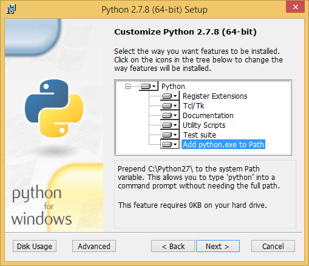
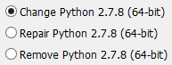
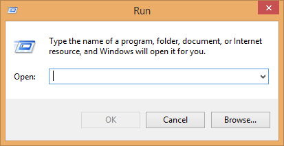
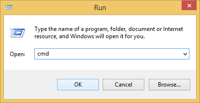
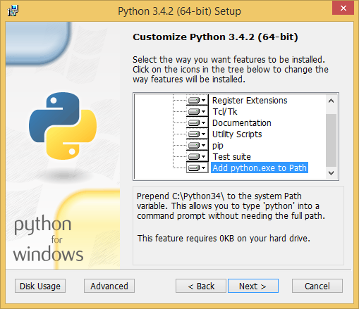
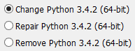

Python 2
---

 [https://www.python.org/downloads/](https://www.python.org/downloads/)

1: Does **not** come with `easy_install` or `pip` in a default installation. It must be installed separately.

2: Does **not** add the default `C:\Python27\Scripts` to the `PATH` if `Add Python.exe to PATH` was selected during installation

3: `PATH` can be added by running the installer again and selecting `Change Python`

### Install pip for Python 2

Use the `run` command by pressing this key combination:

~~~
Windows Key + r
~~~

Once this is open copy and paste this command. This command depends on having Powershell 3 or later.

~~~
powershell Invoke-WebRequest https://bootstrap.pypa.io/get-pip.py -OutFile $home\get-pip.py;C:\Python27\python $home\get-pip.py
~~~

### Installing mkdocs

Use the `run` command by pressing this key combination:

~~~
Windows Key + r
~~~

**Optional:** To Set the required `PATH` per `cmd` session use this command:

~~~
set PATH=%PATH%;C:\Python27\;C:\Python27\Scripts
~~~

With no `PATH` settings:

~~~
C:\Python27\Scripts\pip install mkdocs
C:\Python27\Scripts\mkdocs new my_project
cd my_project
C:\Python27\Scripts\mkdocs serve
~~~

If `C:\Python27\Scripts` is added to your `PATH`:

~~~
pip install mkdocs
mkdocs new my_project
cd my_project
mkdocs serve
~~~

Python 3
---

 [https://www.python.org/downloads/](https://www.python.org/downloads/)

1: **Does** come with `easy_install` or `pip` in a default installation

2: **Does** add the default `C:\Python34\Scripts` to the `PATH` if `Add Python.exe to PATH` was selected during installation

3: `PATH` can be added by running the installer again and selecting `Change Python`

### Installing mkdocs

Use the `run` command by pressing this key combination:

~~~
Windows Key + r
~~~

**Optional:** To Set the required `PATH` per `cmd` session use this command:

~~~
set PATH=%PATH%;C:\Python34\;C:\Python34\Scripts
~~~

With no `PATH` settings:

~~~
C:\Python34\Scripts\pip install mkdocs
C:\Python34\Scripts\mkdocs new my_project
cd my_project
C:\Python34\Scripts\mkdocs serve
~~~

If `PATH` was added during installation:

~~~
pip install mkdocs
mkdocs new my_project
cd my_project
mkdocs serve
~~~

Python Active State for Python 2 and 3
---

1: **Does** come with `easy_install` or `pip` in a default installation

2: **Does** add the default `C:\Python27\Scripts` or `C:\Python34\Scripts` to the `PATH` by default during the installation

[http://www.activestate.com/activepython/downloads](http://www.activestate.com/activepython/downloads)

### Installing mkdocs

~~~
pip install mkdocs
mkdocs new my-project
cd my_project
mkdocs serve
~~~

